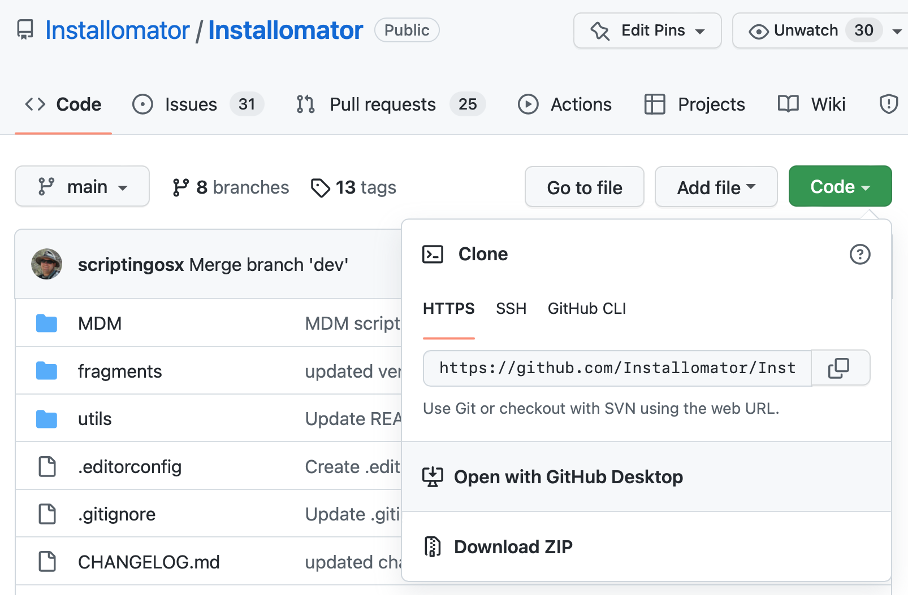
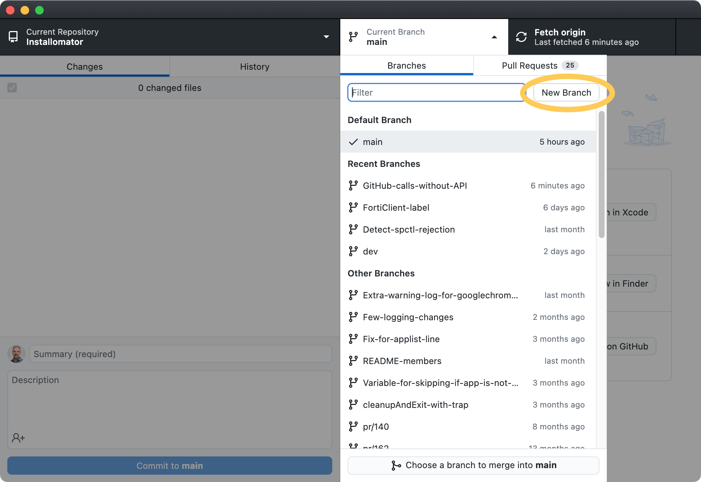
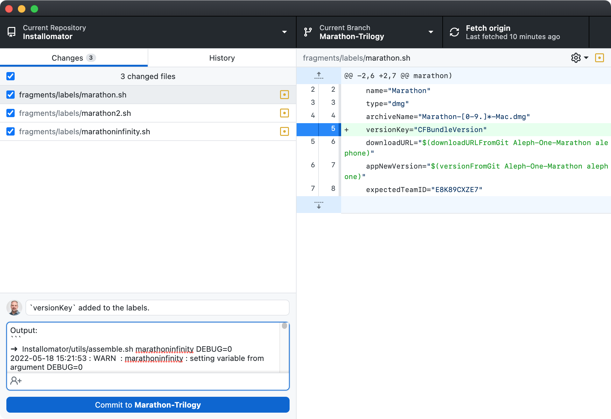
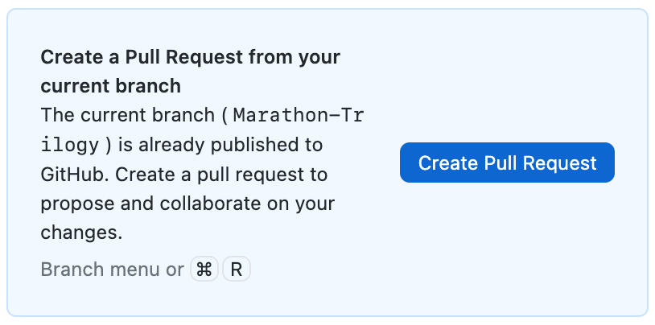

This is the first quick version of these instructions.

## Create GitHub account

You can create an account on GitHub and download the [GitHub Desktop](https://desktop.github.com) application to your Mac. Then you can use the green Open-button to open Installomator in your Desktop app:



## Create a branch for your label or other changes

In order to make changes you need to create a new branch. In GitHub Desktop go to the Branch “main” and create a new branch. Give it a descriptive name such as the label name or `label name-update`.



## Make changes

__Remember to not change the Installomator.sh script, but the add or modify files in the `fragments` folder or sub-folders!__

Now your branch can be edited and new label files can be edited or other changes/improvements can be made.

Different Text editors can be used for this, but Xcode, BBEdit, or Sublime Text are great solutions.

Testing Installomator is done with the `assamble.sh` script:
```
Installomator/utils/assemble.sh label
```

If you want to test it on your system, run like this:
```
sudo Installomator/utils/assemble.sh label DEBUG=0
```

Of course other variables can be used on these commands, as well.

## Commit changes

GitHub Desktop lets you commit changes to your branch.



__Remember to document your changes before you commit.__ Then we can see what has been done.

A Terminal output of the label running should be added as a comment to the pull request.

## Create Pull Request (PR)

After changes are committed, you can create a Pull Request (PR).



You will be taken to the GitHub web page to create the PR, and then it will appear in [the list of PRs](https://github.com/Installomator/Installomator/pulls).

Once you have submitted the PR, remember to switch back to the main branch. Any commits you add to the PR branch _will be added_ to the PR. This may be necessary when you need to amend the PR, but generally you want to avoid this. When the PR gets merged, your local branch becomes redundant and you can delete it.

If you have multiple **related** labels or changes, you can put them all into a single PR, but generally we prefer one PR per label. That allows us to react differently to each label, instead of having to accept or reject all at once.

__We thank you for you contribution to the project!__
